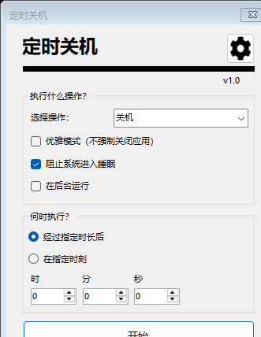
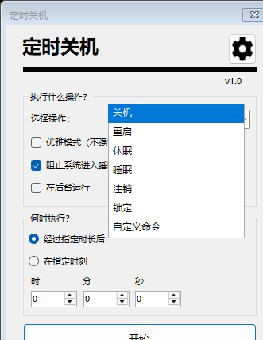
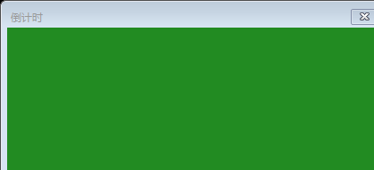
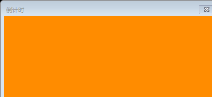
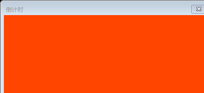
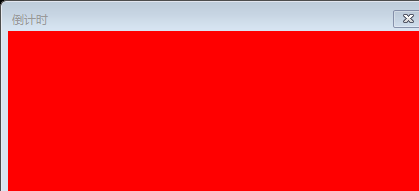
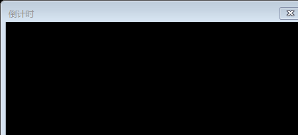
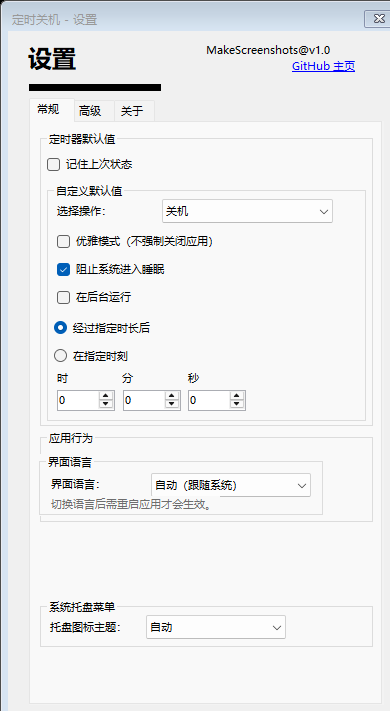
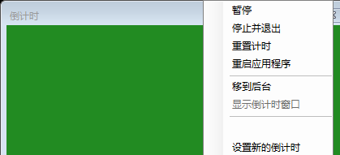
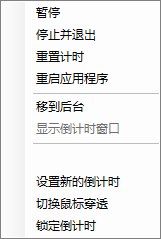

# 定时关机 经典版（Shutdown Timer Classic）🕒

一个小型 Windows 应用：设定时间后让电脑自动**关机、重启、休眠、睡眠、注销或锁定**。



本仓库是 [lukaslangrock/ShutdownTimerClassic](https://github.com/lukaslangrock/ShutdownTimerClassic) 的**中文汉化 + 改造版**。上游采用 MIT 许可证，本改造遵循同样的条款。

[English README](README.md)

---

## 本版本改了什么

| 类别 | 说明 |
|---|---|
| **界面汉化** | 全部界面文本走资源文件，支持**简体中文 / English / 跟随系统**三档切换 |
| **运行时升级** | 从 .NET Framework 4.8 迁移到 **.NET 8**（`net8.0-windows`） |
| **架构修正** | 电源动作的"显示名"与"内部标识"彻底解耦（见下方说明） |
| **新特性** | 倒计时窗口**鼠标穿透**、**Ctrl+滚轮缩放**并记忆尺寸 |
| **CI** | 新增 Linux 快速编译检查（`-warnaserror`），Windows 任务产出可运行文件 |

### 关于语言切换

设置 → 常规 → **界面语言**：`自动（跟随系统）` / `English` / `简体中文`。

切换后需要**重启应用**生效。语言名在两种界面里都保持自描述（中文界面里 English 仍显示为 English），避免切错语言后读不回来。

### 为什么汉化没有破坏配置和脚本

上游把下拉框的**显示文本**直接当业务标识用（`actionComboBox.Text == "Shutdown"`、`switch (action)` 等）。直接把选项改成"关机/重启"会连带打断优雅模式判断、动作分发、用户配置文件和所有 CLI 脚本。

本版本改为：

- 内部统一使用 `PowerAction` 枚举，`settings.json` 与日志继续存**英文 Key**
- 界面显示走本地化资源
- 读取配置和解析 CLI 参数时**同时接受**英文 Key（大小写不敏感）与当前语言的显示名

因此老用户的 `settings.json` 和已有脚本**无需修改**即可继续工作。

---

## 安装 💿

**推荐**：[Microsoft Store](https://www.microsoft.com/store/apps/9NTDG6C9BTTW?cid=github.com)（唯一能自动更新的官方渠道）

**备选**：[GitHub Releases](https://github.com/lukaslangrock/ShutdownTimerClassic/releases)

使用 ZIP 版时请**解压全部文件并保持在同一目录**，不要重命名。

---

## 使用 ✨

在下拉菜单里选择电源操作，然后设定时间。倒计时归零时执行所选操作。



**强制关闭提醒**：归零时程序会让 Windows 强制关闭仍在运行的应用，以确保关机不被打断。若担心数据丢失，请留足时间，或改用*睡眠* / *休眠*。

**优雅模式**：若确信所有应用都能正常退出、不需要人工干预，可勾选"优雅模式（不强制关闭应用）"。此时执行的是常规关机，应用可以阻止关机——请谨慎使用。该模式适用于所有会强制关闭应用的操作，不限于关机。

**颜色提示**：倒计时窗口有 4 种背景色 + 1 种动画。

| 剩余时间 | 颜色 | 动画 |
|---|---|---|
| > 30 分钟 | 绿色 | 无 |
| 30–10 分钟 | 黄色 | 无 |
| 10–1 分钟 | 橙色 | 无 |
| < 1 分钟 | 红 / 黑 | 有 |







**置顶**：默认始终置顶。可在 设置 → 高级 → 倒计时窗口 里关闭（"禁用始终置顶行为"）。




---

## 新特性

### 鼠标穿透

开启后，鼠标点击会**穿过**倒计时窗口落到下层内容，适合边看视频/干活边挂着倒计时。

- 开关位置：设置 → 高级 → 倒计时窗口 → "鼠标穿透（忽略鼠标输入）"
- 也可在**托盘右键菜单**里随时切换（"切换鼠标穿透"）

⚠️ 穿透状态下窗口点不动，**只能通过托盘菜单**停止或调整计时器。若同时隐藏了托盘图标，将失去控制入口。

### 窗口大小可调

按住 **Ctrl + 鼠标滚轮**即可缩放倒计时窗口，尺寸会自动保存并在下次启动恢复。

- 重置：设置 → 高级 → 倒计时窗口 → "重置大小"
- 范围：200×90 至 1400×900
- 配合"时钟文字随窗口大小自适应"效果更佳

---

## 托盘菜单 🔧

右键任务栏托盘图标：停止、重置、重新设定倒计时、移到后台 / 显示窗口、切换鼠标穿透、重启应用。



倒计时窗口内右键也能调出同一菜单。

---

## 命令行 💻

> **警告**：命令行参数不会像界面输入那样被校验。拼写错误或漏参数可能导致意外行为，请先测试再写进脚本。

```
参数                    说明

/SetTime <time>         设置倒计时时长。可填秒数，或用 HH:mm:ss / HH:mm。

/SetAction <action>     设置倒计时归零后执行的电源操作。
                        可填英文原名（Shutdown、Restart、Sleep ...），
                        也可填中文界面显示名（关机、重启、睡眠 ...），大小写不敏感。
                        完整列表：Shutdown / Restart / Hibernate / Sleep /
                                  Logout / Lock / Custom Command

/SetMode <mode>         设置控制模式。**任何 CLI 参数都必须配合此项才生效。**
                         Prefill:       预填设置，用户仍可手动修改，计时器不自动启动。
                         Lock:          覆盖设置且用户无法修改，计时器不自动启动。
                         Launch:        覆盖设置并启动计时器。
                         ForcedLaunch:  覆盖设置并启动计时器，禁用所有界面控件与退出对话框。

/SetPassword <pwd>      设置锁定界面的密码。密码保存在内存中，但因为是命令行参数传入，
                        极易泄露；应用崩溃时还会出现在日志文件里。
                        切勿使用需要保密的密码！

/Graceful               使用优雅模式（若该操作支持）。即执行可被中断的常规关机。

/AllowSleep             允许系统在倒计时期间进入睡眠（默认会阻止）。

/Background             后台启动，不显示倒计时窗口（显示托盘图标）。

/NoSettings             本次运行不读取也不写入 settings.json。

/TargetTimeOfDay        按"指定时刻"模式解释时间，而非时长。
```

示例：

```bat
ShutdownTimerClassic.exe /SetTime 30:00 /SetAction 关机 /SetMode Launch
ShutdownTimerClassic.exe /SetTime 22:30 /TargetTimeOfDay /SetAction Restart /SetMode Prefill
```

---

## 自动构建与下载 📦

推送到 GitHub 后有两条不同的产物通道，**别搞混**：

| 触发 | 工作流 | 产物位置 | 能否给别人直链 | 会过期吗 |
|---|---|---|---|---|
| 任意 push / PR | `dotnet.yml` | Actions 页面 → Artifacts | ❌ 需登录 GitHub | ✅ 默认 90 天 |
| 打 tag（`v*`） | `release.yml` | **Releases** 页面附件 | ✅ 公开直链 | ❌ 不过期 |

`dotnet.yml` 每次提交都会跑：Linux 快速编译检查 + 本地化校验，Windows 编译 + 跑测试 + 产出便携版。这是"开发构建"，上游 README 也提醒过它可能包含未完成功能。

`release.yml` 只在打 tag 时跑，产出 4 个 ZIP：

```
ShutdownTimerClassic-<tag>-win-x64-selfcontained.zip          ← 解压即用，推荐
ShutdownTimerClassic-<tag>-win-x64-framework-dependent.zip    ← 体积小，需装 .NET 8 桌面运行时
ShutdownTimerClassic-<tag>-win-arm64-*.zip                    ← ARM 设备
```

发版操作：

```bash
git tag v1.3.3
git push origin v1.3.3        # tag 一推上去，Release 自动出现
```

> ⚠️ **fork 上 Actions 默认是关闭的**，第一次要在仓库页面点 **Actions → I understand my workflows, go ahead and enable them**，否则任务不会跑。
>
> ⚠️ 版本号 tag 请用纯数字（`v1.3.3`），别加 `-zh.1` 之类后缀，原因见 `CHANGELOG.md`。

---

## 从源码构建 🛠

需要 **.NET 8 SDK**（Visual Studio 2022 17.8+ 自带）。

```bash
cd src/ShutdownTimer
dotnet restore
dotnet build -c Release
```

产物在 `src/ShutdownTimer/bin/Release/net8.0-windows/`。

**在 Linux/macOS 上编译**：项目已开启 `EnableWindowsTargeting`，可以编译但**不能运行**（WinForms 只能在 Windows 上运行）。

```bash
dotnet build src/ShutdownTimer/ShutdownTimer.csproj   # 非 Windows 也可做语法/引用检查
```

打包项目（`WindowsApplicationPackaging.wapproj` 商店包、`WindowsInstallerPackaging.vdproj` 安装器）仍是 Windows 专用，需要 Visual Studio 的 Installer Projects 扩展，且尚未针对 .NET 8 适配。

### 本地化工具链

| 脚本 | 作用 |
|---|---|
| `tools/gen_strings.py` | 从单一双语表生成 `Strings.resx` / `Strings.zh-CN.resx`，key 不一致时报错 |
| `tools/localize_designer.py` | 按映射表把 Designer 里的硬编码文本替换为 `Loc.T(...)`，并报告未覆盖项 |
| `tools/localize_code.py` | 同上，处理弹窗 / 提示 / 通知 |
| `tools/check_i18n.py` | 校验代码引用的每个 key 都存在、占位符数量匹配 |
| `tools/check_layout.py` | 估算中文 + 雅黑下的控件宽度，找出可能破版处 |
| `tools/verify.sh` | **一键跑完上面全部检查 + 编译** |

改文案的正确流程：**只改 `tools/gen_strings.py` 里的对照表 → 跑 `./tools/verify.sh`**。

```bash
./tools/verify.sh     # 生成资源 → 校验 key/占位符 → 破版估算 → 编译（警告即失败）
```

### 测试

`tests/ShutdownTimer.Tests/` 锁住的是**兼容性契约**——汉化最容易搞坏的不是标签，而是上游"把下拉框显示文本当业务标识用"的地方：

- `PowerActionTests`：上游 `settings.json` / CLI 里的每个值仍能被解析（大小写不敏感、含 `Reboot`/`Logoff` 别名）；`Key()` 拼写被冻结（它会写进用户配置）；优雅模式可用性判断与上游原规则一致；非法输入被拒绝而非静默兜底
- `LocalizationTests`：中英资源解析正确；标题模板产出 `关机倒计时` 而不是坏掉的"关机 Timer"；缺 key 显示为 `[key]`；语言名保持自描述

⚠️ WinForms 测试主机需要 Windows 上的 `Microsoft.WindowsDesktop.App` 运行时，**测试只能在 Windows 上执行**（Linux/macOS 上仅能编译，`verify.sh` 会做编译检查）：

```powershell
dotnet test tests\ShutdownTimer.Tests\ShutdownTimer.Tests.csproj
```

---

## 许可 📄

MIT。上游版权归 Lukas Langrock 所有；本汉化改造同样以 MIT 发布，保留原版权声明。
